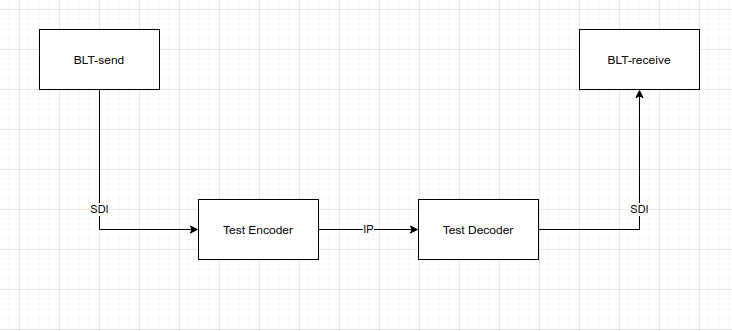

# Broadcast Latency Tester


## Purpose

The "Broadcast Latency Tester" (BLT) solves two problems

1. Having a source available with a frame counter, allowing latency comparisons
2. Having a source available with GLITS on to measure audio sync

Without having to have expensive proprietary equipment. This will run on any machine with a blackmagic card.

## Installation

To install bcn, use Ubuntu 20.04 and install the blt package. Also install the Blackmagic drivers - 12.2 is a good year. Update the firmware and reboot. 

Run ```sudo /opt/blt/bin/install.sh```


Run ```/opt/blt/bin/BLT``` to get the name of the card and output you want, the below assumes you're using a Decklink Duo 2

```
You must select a device
Usage: BLT -d <device id> -m <mode id> [OPTIONS]

    -d <device id>:
         0: DeckLink Duo (1)
         1: DeckLink Duo (2)
         2: DeckLink Duo (3) (inactive)
         3: DeckLink Duo (4) (inactive)
```

You then need to edit the file /opt/blt/etc/blt-settings.conf

```CARD="DeckLink Duo (1)"```

Set this to the value above

```FRATE=25```

At some point I'll work out how to do 30000/1001 framerates, and perhaps (easier) 50fps

```TOD=1000```

This is a value to allow syncing the output of the time to ensure that the displayed time is accurate

```DEVICE=1```

The SDI output from above (BLT) to use

```DEVICEMODE=11```

This varies depending on the card, run ```/opt/blt/bin/BLT -d 0``` (where 0 is the output device) to see the format, you'll want 1080i50 (other formats won't work)

```CALIB=0```
This is to calibrate the read part of BLT. First calibrate the generation part, then pump BLT output into itself, and set the value to get the delay down to zero


## Usage
Once installed the BLT generator should run by itself. To use the reader, simply visit the BLT webpage and see the display.


### Measuring audio sync

Take the output of the BLT and route into a video encoder. Point the encoder at a decoder, and route the decoder back to the BLT. See the webpage to ensure the signal is looping through and the reported audio latency is correct. Leave to run for a few hours.


The BLT can test other SDI signal chain, but it's main purpose is for measuring IP encode/decode latency and drift

### Measuring video latency (method 1)

Set up the system as for measuring audio sync, but tee off to two separate monitors


Take a picture of the two identical monitors or multiviewer inputs, subtract the frame count, and that's your latency. To ensure your monitors are introducing different delays, it's worth swapping the inputs round just con confirm

### Measuring video latency (method 2)
This **requires** a calibrated encoder and decoder, but can be used when you don't have two monitors in the same room/continent



### Measuring change over time
BLT will log data over time, just look at the graph on the website.

## Details
### Generator


Using FFMPEG and a blackmagic card we can create a fairly useful test card

It has the following features

#### Left/Right GLITS
 

In the top left corner, every 4 seconds, audio vanishes on the left leg and a red square, 100px * 100px, appears. Shortly after audio vanishes on the right leg and a green square appears offset from the left square by 100px. 

(The audio isn't neccersarilly 1kHz / 0dB)

#### Moving frame-rate box


The top box moves rightwards every frame, crossing the screen once per second, showing a codec hasn't frozen

#### Moving field-rate box


The top box moves rightwards every field, crossing the screen once per second, showing if fields are reversed or something else is "off" with them, it should appear smoother than the frame-rate box above

#### Field indicator


Field 1 or Field 2 is printed on each field, showing if just one field is shown

#### Frame counter
A number since the start increments, one per frame, allowing easy comparison between two different sources with different latencies


#### Time of day


The time of day of the generating computer. This is based on NTP from the generating machine, however needs calibrating to cope with different cards. The end-to-end latency for an encode+decode process is typically 6 frames, but the output needs calibrating by comparing with a correct time of day source.

The date is encoded in binary underneath (the < and > characters), allowing a reader application to easily decode and calculate end to end delay between different sites without using an excessive amount of CPU OCRing each frame. The time is based on the start time plus the number of displayed frames. This does seem to drift about 1 frame an hour, as such BLT by default automatically restarts the output process every 30 minutes.

### READER


A program can be used to decode the testcard, this outputs as a webpage showing the current input picture, and decoding it


#### Audio Offset
This records the time between the audio supposed to be vanishing (at the start of the first frame when solid red is shown in the top left corner), and the audio actually vanishing. This is graphed in blue over the last few hours on the right of the screen and displayed in milliseconds. 


#### Latency
This decodes the time of day, there are caveat. The time of day is measured by counting the number of frames from when the decoder changes second to when the received decoder changes second. Latency could be a frame out either way even when calibrated due to clock drift, and assumes both encoder and decoder are synced with NTP


## License

This program is licensed under GPL, do whatever you want with it (laugh etc), just give back your changes. The C++ code for the Capture program is based on the blackmagic sample code from the decklink drivers, with the license in the header of the files. The modifications to ffmpeg are in [github](https://github.com/isostatic/FFmpeg) (because the code is awful and far to embarrasing to mention to geniuses behind ffmpeg). The binaries provided in this repo are built under x64/ubuntu 20.04 with desktopvideo 12.2.2a6


---

# TODOs

* change ffmpeg to allow encode side calibration
* Manage older log/capture files
* check NTP sync
* Expose older log/capture files
* Make the graph javascript based slippygraph
* overlay changes in detected decoder
* authentication on webpage (based on http header)
* expose and change configuration options from webpage
* Configure from the webpage
* Calibration for audio samples?
* Support more than 1080i25

